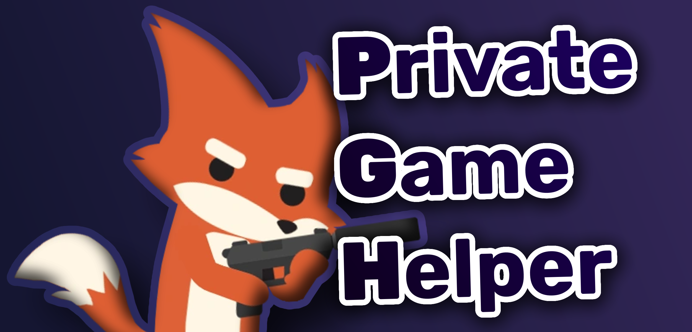

# 

<div align="center">

  
  
  [](https://discord.com/users/484740625137139733)
  [](https://twitter.com/Suchy4992)
  [](https://ko-fi.com/suchy499)

</div>

Private Game Helper is a tool designed to streamline the process of hosting and managing private matches in [Super Animal Royale](https://store.steampowered.com/app/843380/Super_Animal_Royale/). It features a rich GUI that allows the user to pick and choose their match settings, save them in a preset and apply them faster than entering them manually. The tool also comes with a built in tournament calculator!

## Table of Contents

- [Installation](#installation)
  - [Method #1](#method-1)
  - [Method #2](#method-2)
- [Usage](#usage)
- [Notes](#notes)
- [Changelog](#changelog)
  - [v2.1.1](#v211)
- [Feature checklist](#feature-checklist)
- [Disclaimer](#disclaimer)

## Installation

### Method #1

- Download a release from [GitHub](https://github.com/Suchy499/PrivateGameHelper-for-Super-Animal-Royale/releases/latest)
- Extract the zip file or use the installer
- Run `Private Game Helper.exe`

### Method #2

- Install [Python 3.12](https://www.python.org/downloads/release/python-3126/) (does not work with other versions)
- Clone (or download) the repo:
  
  ```
  git clone https://github.com/Suchy499/PrivateGameHelper-for-Super-Animal-Royale.git
  ```

- Run `setup.py`

## Usage

The documentation has been migrated to the [GitHub Wiki](https://github.com/Suchy499/PrivateGameHelper-for-Super-Animal-Royale/wiki).

## Notes

- Currently only works on Windows
- Do not press any keys after using a button that changes in-game setting until the program has finished doing so
- Preferably have your in-game chat closed before using the program (The program will still try to detect whether the chat is open or not, but this may not work 100% of the time)
- Setting up dodgeball ziplines might not work properly if your display isn't using a 16:9 aspect ratio. To resolve this issue, change your in-game resolution to a 16:9 aspect ratio (e.g., 1920x1080, 1280x720) and run the game in windowed mode.

## Changelog

### v2.1.1

- You can now change the host for custom game modes by clicking on the player's name in the team picker
- Added a toggle for tournament discord integration
- Optimized the graph creation process
- Removed players with 0 rounds played from graphs and leaderboards
- Added secondary sorting in case a tiebreaker is needed
- You can now select which players get awarded kill leader points in case of a tie
- BUGFIX: Fixed a bug where leaderboard was not displayed properly if there was only one round played

## Feature checklist

- [ ] Close the central overlay widget by clicking on an active button on the sidebar
- [ ] Add random weapons for duels
- [ ] Make it possible to teleport multiple selected players at once
- [ ] Map preview for custom game modes

## Disclaimer

Materials from the [Super Animal Royale Wiki](https://wiki.animalroyale.com/wiki/Super_Animal_Royale_Wiki) are under [CC BY-NC-SA 3.0](https://creativecommons.org/licenses/by-nc-sa/3.0/) license.  
Super Animal Royale is a trademark owned by Pixile Studios. This project is not associated with Pixile Studios in any form.
