# 

<div align="center">

  
  
  [](https://discord.com/users/484740625137139733)
  [](https://twitter.com/Suchy4992)
  [](https://ko-fi.com/suchy499)

</div>

Tired of typing out each command by hand in your private games?
Private Game Helper makes hosting private games in Super Animal Royale easy by providing a simple UI and an overlay.

## Table of Contents

- [Installation](#installation)
  - [Method #1](#method-1)
  - [Method #2](#method-2)
- [Usage](#usage)
  - [Presets](#presets)
  - [Pregame](#pregame)
    - [General](#general)
    - [Settings](#settings)
    - [Spawn Rates](#spawn-rates)
  - [Players](#players)
  - [Teleport](#teleport)
  - [Items](#items)
    - [Weapons](#weapons)
    - [Consumables](#consumables)
    - [Equipables](#equipables)
    - [Vehicles](#vehicles)
  - [Commands](#commands)
  - [Duels](#duels)
    - [Settings](#settings-1)
    - [Teams](#teams)
    - [Weapons](#weapons-1)
  - [Dodgeball](#dodgeball)
    - [Settings](#settings-2)
    - [Teams](#teams-1)
    - [Keybinds](#keybinds)
  - [Settings](#settings-3)
  - [Overlay](#overlay)
- [Notes](#notes)
- [Changelog](#changelog)
  - [v2.0.0](#v200)
- [Feature checklist](#feature-checklist)
- [Disclaimer](#disclaimer)

## Installation

### Method #1

- Download a release from [GitHub](https://github.com/Suchy499/PrivateGameHelper-for-Super-Animal-Royale/releases/latest)
- Extract the zip file or use the installer
- Run `Private Game Helper.exe`

### Method #2

- Install [Python 3.12](https://www.python.org/downloads/release/python-3126/) (does not work with other versions)
- Clone (or download) the repo:
  
  ```
  git clone https://github.com/Suchy499/PrivateGameHelper-for-Super-Animal-Royale.git
  ```

- Run `setup.py`

## Usage

### Presets

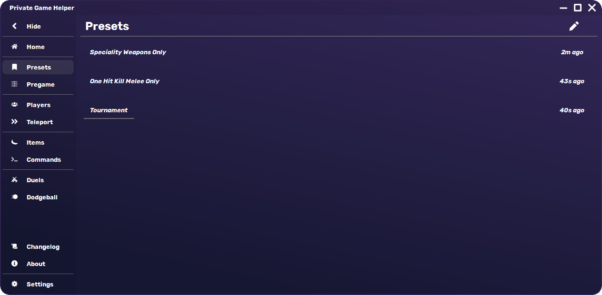

This is where your saved presets will show up, to select a preset simply click on its name.

### Pregame

This is where you will find everything related to the pregame lobby, as well as being able to save, edit or delete a preset.

#### General

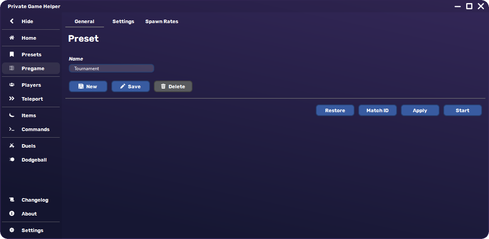

Here you can create a preset after giving it a name and choosing your settings in the next two pages.

- `New` creates a new preset with the given name
- `Save` updates the currently active preset
- `Delete` deletes the currently active preset
- `Restore` resets your currently selected settings to default, doing so does not reset your preset unless you save it afterwards.
- `Match ID` copies the match ID to your clipboard
- `Apply` applies selected settings in-game (should only be used once per private match)
- `Start` starts the private match

#### Settings

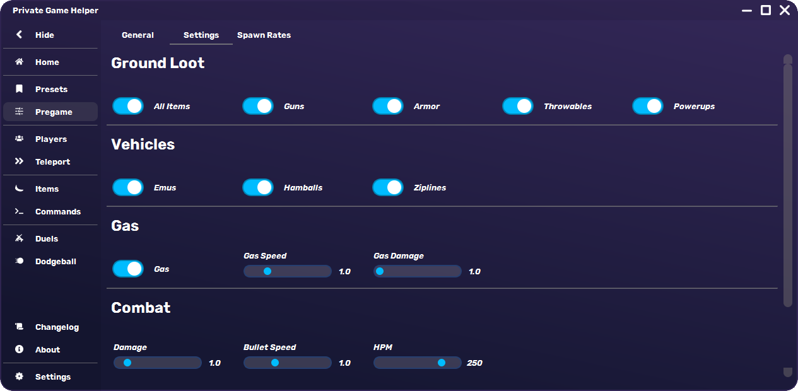

Here you can select your settings before applying them in-game.

#### Spawn Rates

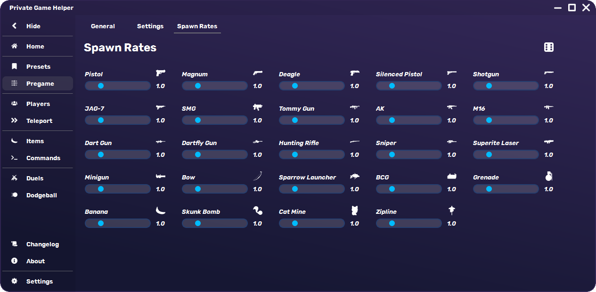

Here you can set spawn rates for each individual weapon and throwable.

### Players

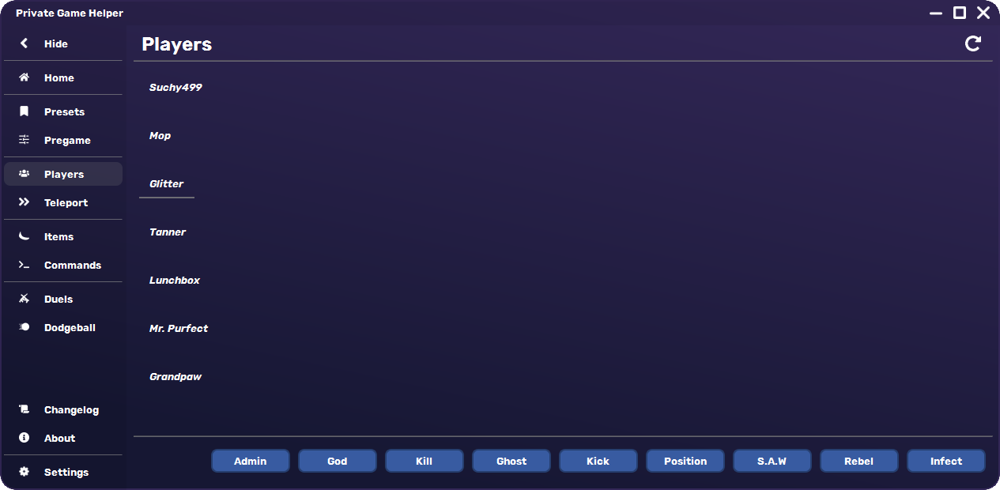

This is the main page where you can perform actions on players in your lobby.
The list of players is always synced within the program and all its pages.

- There is no way to automatically detect players in your lobby, so the `refresh button` on the top right is there to update the list.
- `Admin` gives the selected player admin rights
- `God` toggles god mode for the selected player
- `Kill` kills the selected player
- `Ghost` ghosts the selected player
- `Kick` kicks the selected player
- `Position` gets the position of the selected player
- `S.A.W.` and `Rebel` switch the player (and their squad) to the selected team in S.A.W. vs REBELLION (only works before the game starts)
- `Infect` infects the selected player (only works in bwoking dead)

### Teleport

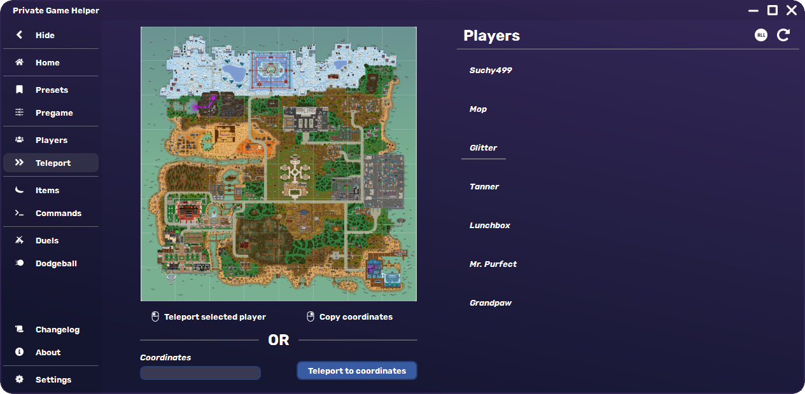

This is where you can teleport players to a specific location on the map either by clicking on a location on the map or by inputting the coordinates manually.  
All you need to do to teleport someone is to select a player from the list (or every player by clicking on the `All` button on the top right) and then select the desired location.

### Items

This is where you can spawn items. These are to be used after the game has started.

#### Weapons

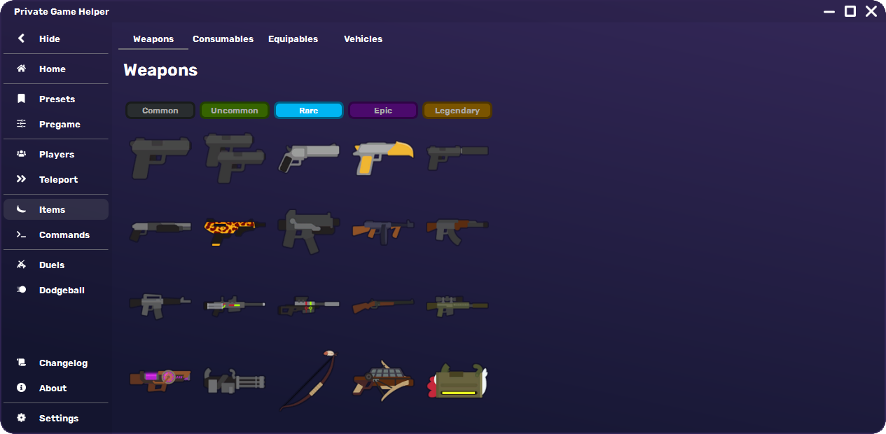

#### Consumables

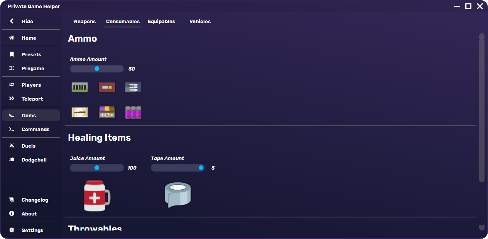

#### Equipables

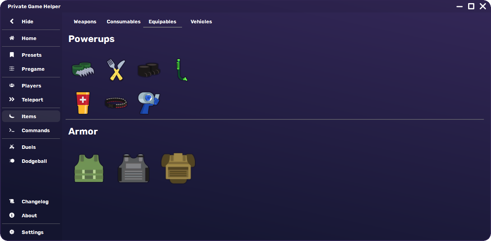

#### Vehicles

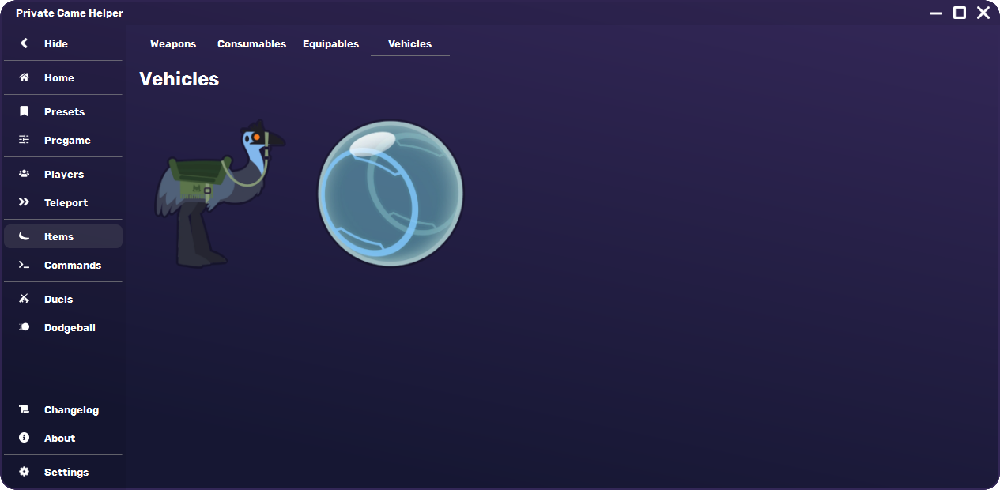

### Commands

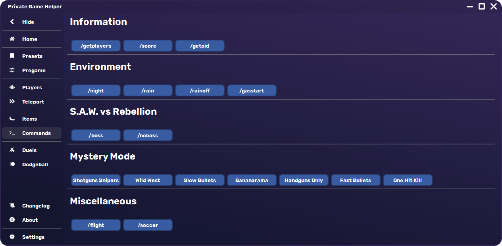

This is where you can input any in-game command you want to use with ease.  
The buttons have useful tooltips to help you understand what each command does when you hover over them.

### Duels

This page is the main page for setting up the duels custom game mode.

In this mode, 2 teams will fight against each others in a small area of the map.  
The teams have a preparation phase where they can choose their setup and then a fighting phase where they will fight to the death.

#### Settings

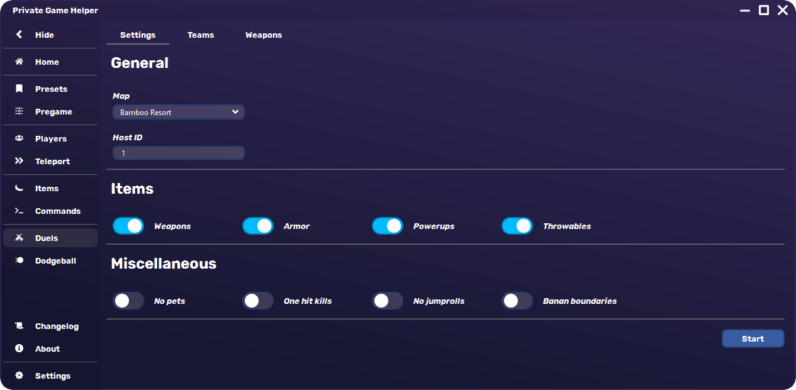

Here you can set up the main settings

- `Map` selects the map for the duels

  | Bamboo Resort | SAW Security | SAW Research Labs | Welcome Center | Penguin Palace |
  | :---: | :---: | :---: | :---: | :---: |
  |  |  | 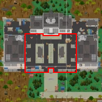 |  |  |

- `HostID` is the field where you should input your own ID (to get your ID, either type `/getpid` in the chat, click the `/getpid` button in [Commands](#commands), or press `` shift + ` `` in-game)

`Banan Boundaries` toggles whether bananas will be used to create the boundaries of the duels area or not (Having this on will take a bit longer to set up the duels)

#### Teams

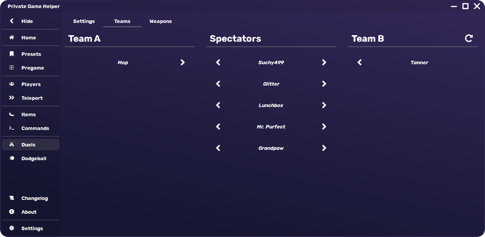

Here you can very easily set up the teams for the duels. All the spectators will automatically be ghosted after the game starts.

#### Weapons

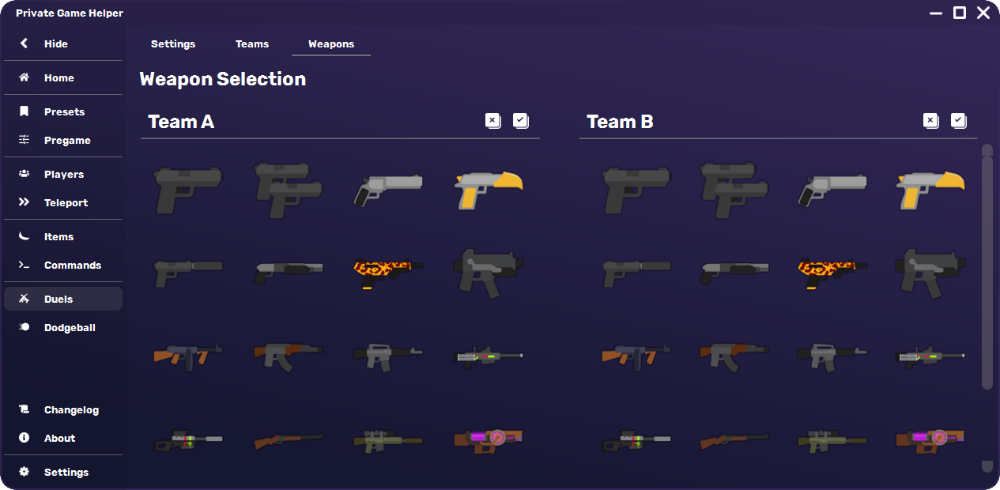

Here you can set up the weapons that will be available for the players to choose from.

Pressing on the `X` or `tick` buttons will either remove or add **every** weapon to the list

### Dodgeball

This page is the main page for setting up the dodgeball custom game mode.

In this mode, 2 teams will fight against each others in a small area of the map only using grenades, while limited to their own side.  
The initial grenades will be located in the line between the two sides and as the match progresses, more grenades will spawn on either side.

*things that aren't described here are the same as in [Duels](#duels)*

#### Settings

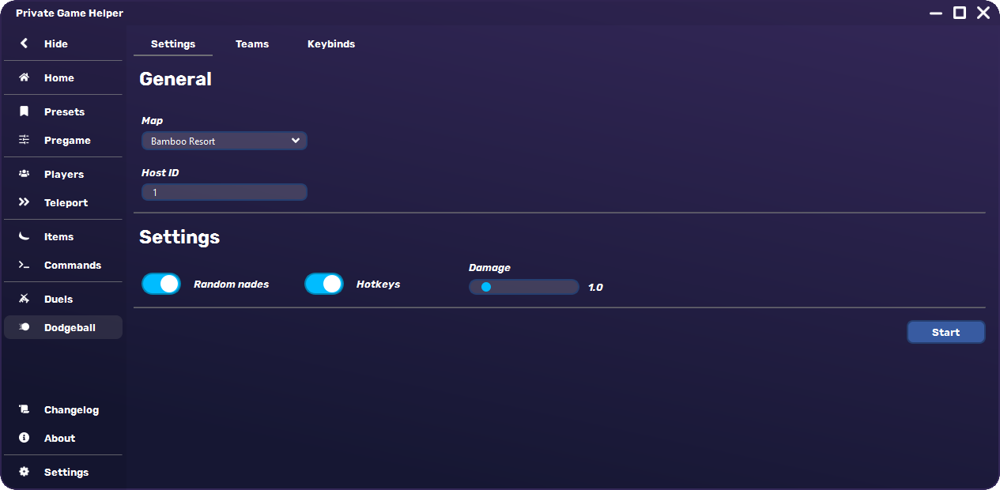

- `Map` selects the map for the dodgeball

  | Bamboo Resort | SAW Security | SAW Research Labs | Welcome Center | Penguin Palace | Pyramid | Emu Ranch | Shooting Range | Juice Factory | Super Sea Land |
  | :---: | :---: | :---: | :---: | :---: | :---: | :---: | :---: | :---: | :---: |
  | 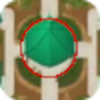 |  | 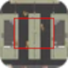 |  |  | 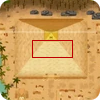 |  |  |  |  |

- `Random nades` toggles whether the grenades that spawn after the initial ones will be in random locations or not
- `Hotkeys` toggles hotkeys
- `Damage` sets the damage multiplier for the grenades

#### Teams

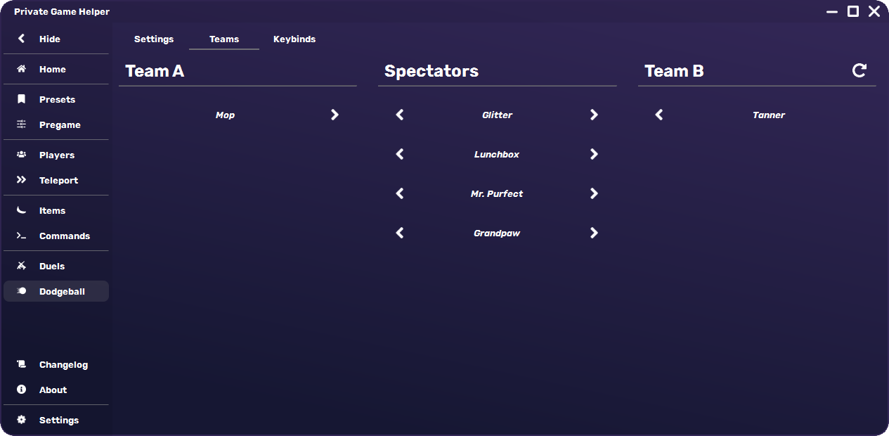

#### Keybinds

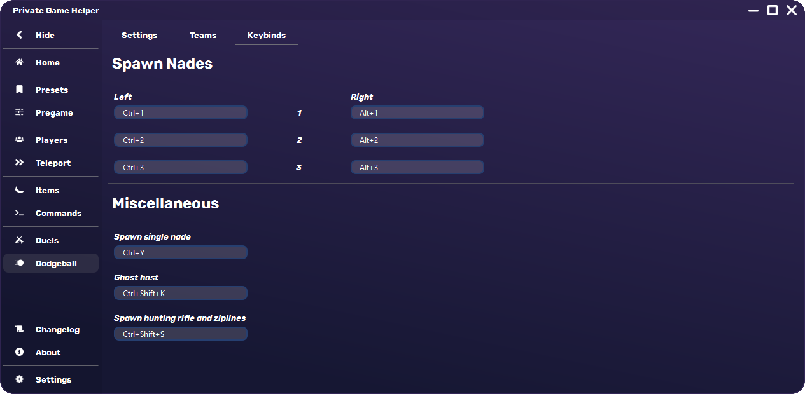

Here you can set up the keybinds.

`Spawn Nades`: There is no way to detect whether the nades have been thrown or not, so you will have to press these keybinds to spawn 1 through 3 nades for both teams starting on the respective side

### Settings

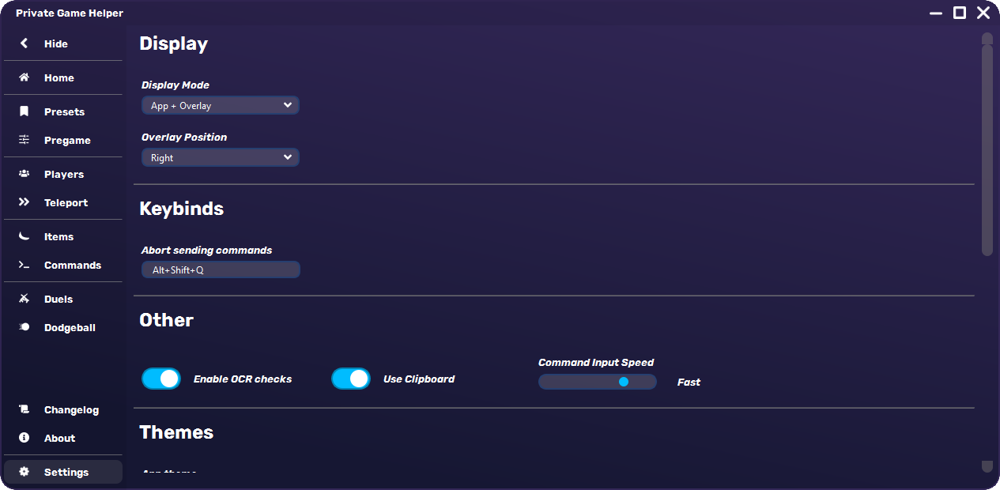

This is where you can change general settings for how the program will behave in all situations.

### Overlay

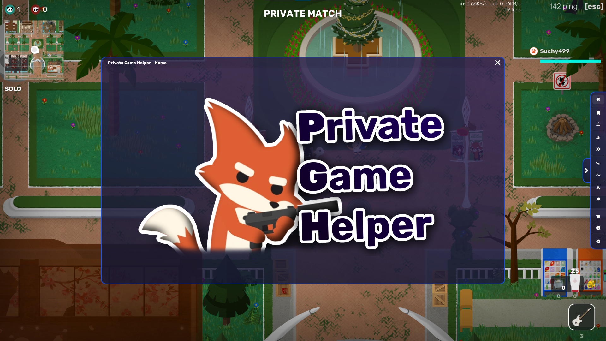

Every page described here is also available in the overlay.

## Notes

- Currently only works on Windows
- Do not press any keys after using a button that changes in-game setting until the program has finished doing so
- Preferably have your in-game chat closed before using the program (The program will still try to detect whether the chat is open or not, but this may not work 100% of the time)
- Setting up dodgeball ziplines might not work properly if your display isn't using a 16:9 aspect ratio. To resolve this issue, change your in-game resolution to a 16:9 aspect ratio (e.g., 1920x1080, 1280x720) and run the game in windowed mode.

## Changelog

### v2.0.0

- Completely redesigned the UI
- Added an overlay
- Added pages:
  - Players list
  - Changelog
  - About
  - Settings
- Presets are now saved in an accessible way
- Teleporting now works by simply selecting a player from the list instead of having to input their ID
- Team assignment for duels and dodgeball has been made a lot easier
- You can now choose which specific weapons will spawn in duels
- Keybinds for dodgeball are now able to be reassigned
- Added a keybind to stop sending commands (Default: `Alt+Shift+Q`)
- Added an auto-updater
- Added OCR checks to minimize unwanted inputs
- You are now able to change the speed at which commands are being sent
- Added themes

## Feature checklist

- [ ] Close the central overlay widget by clicking on an active button on the sidebar
- [ ] Add random weapons for duels
- [ ] Make it possible to teleport multiple selected players at once
- [ ] Map preview for custom game modes

## Disclaimer

Assets used in this project come from the [Official Super Animal Royale Wiki](https://animalroyale.fandom.com/wiki/Super_Animal_Royale_Wiki).  
Super Animal Royale is a trademark owned by Pixile Studios. This project is not associated with Pixile Studios in any form.
